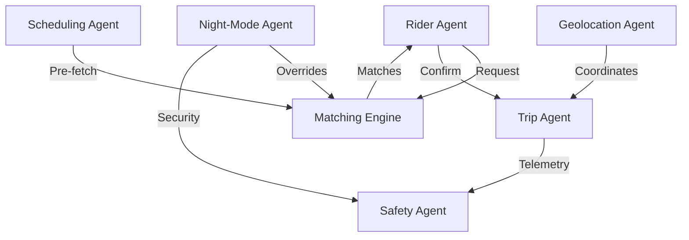

# Shared Cab System — Agents

## System Agents

### 1. Rider Agent
The primary user-facing agent managing the lifecycle of a commuter's journey.
- **Responsibilities:** Dynamic ride request generation, real-time match evaluation, biometric/PIN-based arrival verification, and post-trip social auditing (ratings).
- **Core Persistence:** `currentUserProvider`, `currentRideRequestProvider`, `recurringRidesProvider`.
- **UX Strategy:** Minimal friction interface for high-stress commute scheduling.

---

### 2. Matching Engine Agent
A high-throughput logistics agent that pairs riders using spatial-temporal optimization.
- **Algorithm:** The **80/15 Spatial Overlap Rule** (≥80% route congruence within a 15-minute temporal window).
- **Optimization Heuristics:** Route congruence → Relative time-save → Social compatibility (Rider Rating).
- **Production Specs:** Handles dynamic fare-splitting and multi-segment savings calculations.

---

### 3. Dynamic Night-Mode Agent
A contextual safety agent that modifies system behavior based on environment and local time.
- **Triggers:** Auto-activation (21:00 - 06:00) with manual override capabilities.
- **Safety Interventions:** Enforces same-gender matching protocols, mandates PIN verification, and initiates real-time telemetry sharing with emergency contacts.

---

### 4. Telemetry & Safety Agent
Monitors real-time trip data to detect anomalies and ensure rider safety.
- **Anomaly Detection:** **Route Deviation Engine** auto-detects pathing inconsistencies (>1km off-nominal) and triggers instant SOS protocols.
- **Emergency Hardware Integration:** One-tap SOS broadcast to emergency contacts and local LEA (Law Enforcement Agencies).
- **State Management:** `panicModeProvider`, `routeDeviationProvider`.

---

### 5. Logistics & Trip Agent
Manages the live execution of a trip, coordinating between the map and the rider.
- **Visual Feedback:** High-fidelity map rendering using production-grade visualization standards (Car animation, smooth bearing rotation, and labeled waypoints).
- **Tracking:** Predictive Progress bar, real-time ETA calculation, and milestone status updates (Pick-up → In-Transit → Destination).

---

### 6. Geolocation Agent (Real-Time GPS)
Handles the low-level hardware communication for high-accuracy positioning.
- **Stack:** Production-grade GPS streaming with 5m distance filtering and 3-second signal acquisition timeouts.
- **Fallback Logic:** Graceful degradation to cell-tower triangulation or mock-coordinate anchors for low-signal environments (e.g., parking garages).
- **Telemetry Display:** Pulsing coordinate dot, breadcrumb trail, and active bearing tracking.

---

### 7. Global Scheduler Agent
Automates recurring logistics for daily commuters.
- **Capabilities:** Multi-day schedule management, automated match-queuing, and route-swap optimization.
- **Design Goal:** "Set and Forget" automation for predictable daily travel patterns.

---

### 8. Navigation & Orchestration Agent
The global conductor managing screen transitions and deep-linking.
- **Infrastructure:** `GoRouter` declarative routing with typed parameters for 12+ production-grade routes.

---

## Agent Interaction Topology

